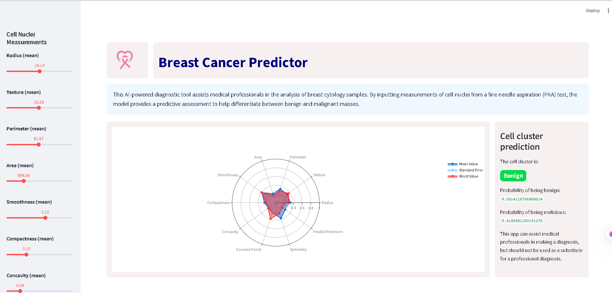

# Breast Cancer Prediction App

A machine learning web app built with Streamlit and Python to predict if a breast cancer tumor is benign or malignant.

## 🚀 Live Demo

The app is deployed on Streamlit Community Cloud. You can try it here:  
**[https://breast-cancer-predictor-ebncpjaxvuzj4vfzstpeax.streamlit.app/](https://breast-cancer-predictor-ebncpjaxvuzj4vfzstpeax.streamlit.app/)**

## 📋 How to Run Locally

1. Run `streamlit run app/main.py` 
    

